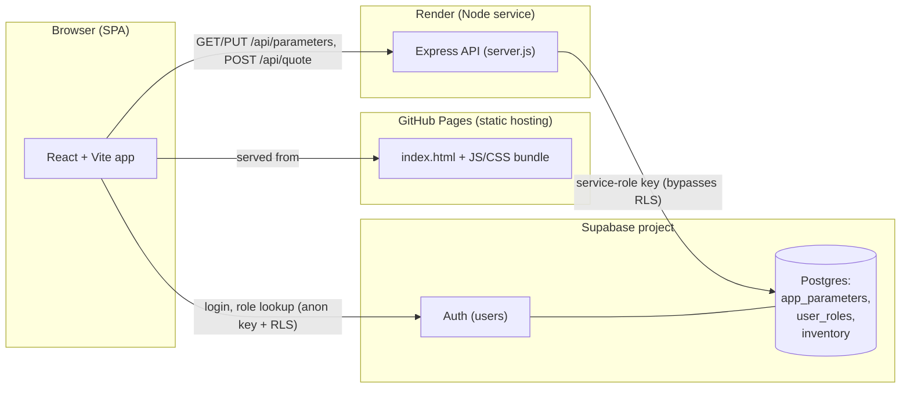
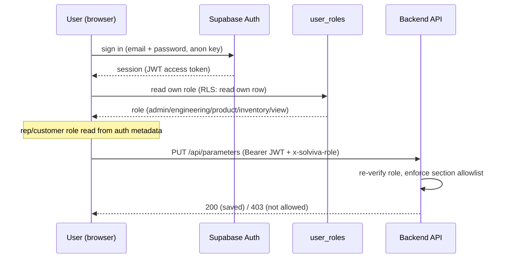
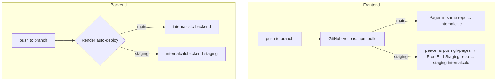

# InternalCalc — System Architecture

A guide for the team: how the Solviva internal calculator is built, deployed, and operated across production and staging.

---

## 1. What it is

InternalCalc is a web-based solar quotation tool used internally by Solviva/AboitizPower sales, engineering, and product teams. Users configure a customer's consumption and package options and the app produces a priced quote (with PDF export). Admin roles can tune the pricing parameters and inventory that drive every calculation.

---

## 2. High-level architecture



- **Frontend** is a static single-page app (SPA) — no server rendering. It's built by Vite and served from GitHub Pages.
- **Backend** is a small Express API on Render that owns the pricing logic and the parameters store.
- **Supabase** provides authentication and the Postgres database (parameters, roles, inventory).

---

## 3. Repositories

| Repo | Purpose | Deploys to |
|---|---|---|
| `solvivaenergy/InternalCalcFrontEnd` | React/Vite SPA (the UI) | GitHub Pages |
| `solvivaenergy/InternalCalcBackEnd` | Express API + Supabase access + DB migrations/seeds | Render |
| `solvivaenergy/InternalCalcFrontEnd-Staging` | Hosting-only repo for the **staging** Pages site (receives built `gh-pages`) | GitHub Pages (staging) |

> The `netlify.toml` / `netlify/functions` files in the frontend repo are **legacy leftovers** from an earlier Netlify deployment and are no longer used.

---

## 4. Frontend (`InternalCalcFrontEnd`)

- **Stack**: React 18 + Vite 5, charts via Recharts, PDF via jsPDF/html2canvas.
- **Entry**: `src/main.jsx` → `src/components/App.jsx`.
- **Key areas**:
  - `src/components/` — UI: `Login.jsx`, `Calculator.jsx`, the `Step1–4` wizard, `Summary.jsx`, admin tabs (`EngineeringTab`, `ProductTab`, `InventoryTab`, `AdminShell`).
  - `src/lib/calculations.js` — client-side pricing/derivation logic.
  - `src/lib/paramsService.js` — fetches saved parameter overrides on boot and merges them over the bundled defaults (mutates the shared `ADMIN_PARAMS`/inventory objects in place).
  - `src/lib/supabaseClient.js` — single browser Supabase client for login + role lookup (uses the **anon** key; RLS is the boundary).
  - `src/lib/permissions.js` — maps roles to the admin sections/keys they may edit (mirrors the backend's server-side allowlist).
  - `src/data/` — bundled defaults: `adminParams.js`, `inventory.js`, `devices.js`.
- **Config**: `src/config.js` reads `VITE_*` env vars (API base URL, Supabase URL/anon key, role passwords) at **build time**.

---

## 5. Backend (`InternalCalcBackEnd`)

- **Stack**: Node + Express (`server.js`), `@supabase/supabase-js`.
- **Endpoints**:
  | Method + Path | Purpose | Auth |
  |---|---|---|
  | `GET /health` | Liveness check | none |
  | `POST /api/quote` | Build a priced quote from input | none |
  | `GET /api/parameters` | Return saved parameter overrides | none (read) |
  | `PUT /api/parameters` | Save parameter overrides | Bearer token + `x-solviva-role` header; server re-checks role |
- **Modules**:
  - `src/quoteService.js` — `buildQuote()` pricing engine.
  - `src/parametersService.js` — `getParameters()` / `putParameters()`; enforces which role may write which parameter sections (server-side security boundary).
- **DB access**: uses the **service-role key** (bypasses RLS). This key must **never** be exposed to the browser or committed.
- **CORS**: `CORS_ORIGINS` env var (comma-separated or `*`).

---

## 6. Database & data model (Supabase / Postgres)

Managed as flat SQL files in `InternalCalcBackEnd/supabase/migrations/` (applied via the Supabase SQL Editor). Seed data is provisioned by `scripts/*.mjs` using the service-role key.

Key tables:

- **`app_parameters`** — a **singleton** row (`id boolean primary key check (id)`) holding a `jsonb payload` of all admin overrides. The backend reads/writes this; the frontend merges it over bundled defaults.
- **`user_roles`** — one role per user (`user_id` PK → `auth.users`). Roles: `admin`, `engineering`, `product`, `inventory`, `view`. (Sales `rep`/`customer` roles are carried in **auth metadata**, not this table.)
- **Inventory tables** — panels/inverters/etc. with RLS guarded by `has_role(...)`.

> **Schema note:** `user_roles.role` is a **TEXT + CHECK** column in production, but an **enum (`app_role`)** in the freshly-built staging DB. This matters when applying `20260731_add_inventory_role.sql` (see the staging runbook).

---

## 7. Authentication & roles



- **Login** is a Supabase email/password form; the anon key is safe to ship because **RLS** limits what it can do.
- **Role** determines which admin sections are editable. The frontend hides UI it can't use, but the **backend independently re-enforces** the allowlist on `PUT /api/parameters` — the UI is not the security boundary.
- **Calculator role passwords** (`VITE_*_PASSWORD`) are a separate, lighter mechanism that unlocks views in the client bundle (rep view, maintenance gate, etc.); they are "good enough to keep honest people honest," not real auth.

---

## 8. Environments

| | Production | Staging |
|---|---|---|
| Branch | `main` | `staging` |
| Frontend URL | `internalcalc.solvivaenergy.com` | `staging-internalcalc.solvivaenergy.com` |
| Backend (Render) | `internalcalc-backend.onrender.com` | `internalcalcbackend-staging.onrender.com` |
| Supabase project | prod project | separate staging project |
| GitHub secrets prefix | `VITE_*`, `RENDER_DEPLOY_HOOK` | `STAGING_VITE_*`, `STAGING_PAGES_DEPLOY_TOKEN`, `RENDER_STAGING_DEPLOY_HOOK` |

Staging is a **fully isolated** copy: its own database, its own users, its own backend service. Testing in staging never touches production data.

### Deployment flow



- **Push to `staging`** in either repo → deploys to the staging environment.
- **Promote** by merging `staging` → `main` in each repo.
- Frontend changes land directly on the domain; backend changes deploy to the Render API the site calls.

---

## 9. Environment variables & secrets

**Frontend (GitHub Actions secrets, injected at build time):**
- `VITE_API_BASE_URL` / `STAGING_BACKEND_URL` → which backend the SPA calls
- `VITE_SUPABASE_URL`, `VITE_SUPABASE_ANON_KEY` (+ `STAGING_*` equivalents)
- Role passwords: `VITE_AUDIT/SUPERADMIN/ENGINEERING/PRODUCT/REP/MAINTENANCE_PASSWORD`
- `STAGING_PAGES_DEPLOY_TOKEN` — PAT that lets the workflow push to the staging Pages repo

**Backend (Render service env vars, at runtime):**
- `SUPABASE_URL`, `SUPABASE_SERVICE_ROLE_KEY` (secret — RLS-bypassing), `PORT`, `CORS_ORIGINS`

> **Rule of thumb:** anon key + `VITE_*` = client/build side (GitHub). Service-role key = server side only (Render). Never put the service-role key in a `VITE_*` variable.

---

## 10. Local development

**Frontend:**
```bash
cd InternalCalcFrontEnd
cp .env.example .env.local   # fill in VITE_* values
npm install
npm run dev
```

**Backend:**
```bash
cd InternalCalcBackEnd
# .env holds prod creds; .env.staging holds staging creds (both gitignored)
npm install
npm start                                   # uses .env (prod)
# target staging instead:
$env:DOTENV_CONFIG_PATH = ".env.staging"; npm start
```

---

## 11. Operational runbook (common tasks)

- **Deploy a change to staging:** push it to the `staging` branch of the relevant repo; watch the Actions/Render deploy; hard-refresh the site (`Ctrl+F5`).
- **Apply a DB migration:** run the SQL file in the target Supabase project's SQL Editor, in filename (chronological) order.
- **Seed / mirror users into staging:**
  ```bash
  $env:DOTENV_CONFIG_PATH = ".env.staging"; node scripts/seed-admin-staff.mjs
  node scripts/mirror-users-to-staging.mjs   # copies all prod users → staging (shared password)
  ```
- **Copy tuned parameters prod → staging:** `select payload from app_parameters` on prod, then `update app_parameters set payload = '<json>' where id = true` on staging.

### Gotchas worth knowing
- **Custom domain HTTPS:** the Cloudflare DNS record for a GitHub Pages domain must be **grey-cloud (DNS only)**, or the Let's Encrypt cert won't issue and HTTPS can loop.
- **Backend URL naming:** the staging service is `internalcalcbackend-staging` (no hyphen after `internalcalc`) — a wrong hostname returns Render's `404 / X-Render-Routing: no-server`.
- **Staging `user_roles` is an enum**, so add roles with `ALTER TYPE public.app_role ADD VALUE ...`, not a CHECK constraint.
- **Prod users don't exist in staging** — mirror or seed them first.

---

## 12. Glossary

- **RLS** — Row-Level Security; Postgres policies that constrain what the anon/authenticated key can read/write. The real client-side security boundary.
- **Service-role key** — Supabase admin key that bypasses RLS; backend-only.
- **`app_parameters` payload** — the single JSON blob of admin overrides applied on top of the code's bundled defaults.
